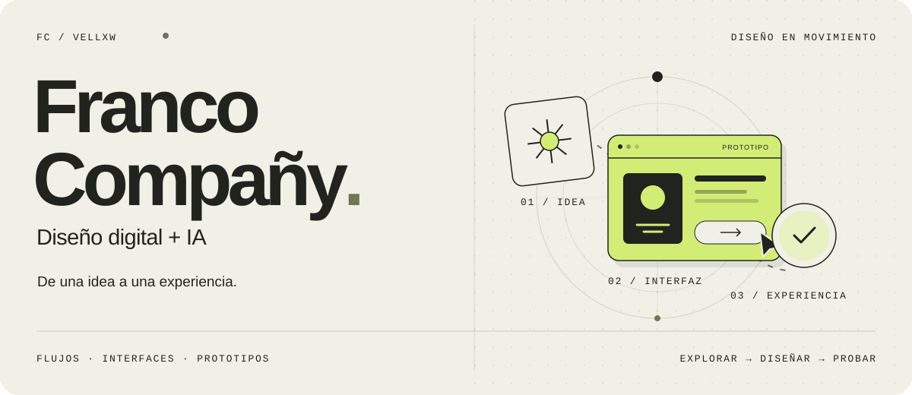
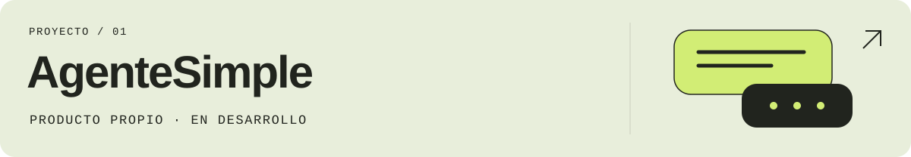
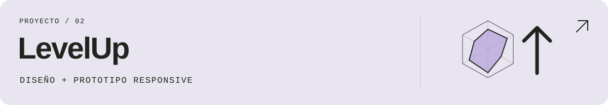
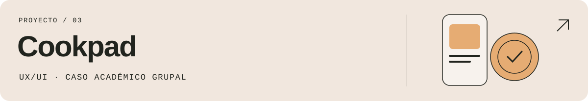

<picture>
  <source media="(prefers-reduced-motion: reduce) and (max-width: 600px)" srcset="./assets/profile-hero-mobile.svg">
  <source media="(prefers-reduced-motion: reduce)" srcset="./assets/profile-hero.svg">
  <source media="(max-width: 600px)" srcset="./assets/profile-hero-mobile.gif">
  
</picture>

[Portfolio](https://www.behance.net/francocompay) · [Hablemos](mailto:francocompany01@gmail.com)

## Diseño experiencias. Construyo para probarlas.

Soy **Franco Compañy**, estudiante de Diseño Multimedial en la UNLP. Trabajo con flujos, wireframes y prototipos en Figma, y exploro cómo la IA puede ayudar a convertir una idea en una experiencia digital.

En este espacio conviven diseño, prototipos y desarrollo: distintas formas de probar una misma idea.

## Proyectos seleccionados

### AgenteSimple · IA aplicada a WhatsApp

**Producto propio · En desarrollo**

Un proyecto que conecta atención por WhatsApp, CRM y agenda con IA. Una exploración de cómo organizar conversaciones, información y acciones en una experiencia de producto.

[Explorar el sitio](https://agentesimple.com.ar/)

 

### LevelUp · Una experiencia editorial gamer

**Diseño de producto · Prototipo responsive con apoyo de IA**

Un prototipo editorial gamer para explorar noticias, lanzamientos y seguimiento personalizado. Construido con Next.js, React, TypeScript y Tailwind.

[Ver el proyecto y su código](https://github.com/vellxw/LevelUp)

 

### Cookpad · Repensar el primer recorrido

**UX/UI · Rediseño conceptual académico · Trabajo grupal**

Un caso de diseño enfocado en el onboarding de una aplicación de recetas. Flujos, exploración y prototipado en Figma y FigJam, en colaboración con Oriana Capurro.

[Ver el caso de diseño](https://www.behance.net/gallery/249672827/Cookpad-Rediseno-de-aplicacion-UXUI)

## Del diseño al prototipo

- **Entender el recorrido.** Organizar la información y los flujos antes de diseñar pantallas.
- **Dar forma a la experiencia.** Pasar de wireframes a interfaces y prototipos en Figma.
- **Probar con algo concreto.** Usar código e IA para explorar interacciones y llevar las ideas a prototipos.

También exploro experiencias lúdicas: [**Magic Casters**](https://github.com/vellxw/MagicCasters-VibeJam2026) es un prototipo para VibeJam 2026 con hechizos por voz o teclado, construido con Three.js, TypeScript y Colyseus.

Más exploraciones en código

- [**Batch Image Optimizer**](https://github.com/vellxw/batch-image-optimizer): redimensionar y convertir imágenes en el navegador, con descarga en ZIP.
- [**Status Page Lite**](https://github.com/vellxw/status-page-lite): una página para mostrar el estado de servicios.

---

**¿Conversamos sobre diseño y producto digital?**  
[francocompany01@gmail.com](mailto:francocompany01@gmail.com) · [Ver portfolio en Behance](https://www.behance.net/francocompay)
